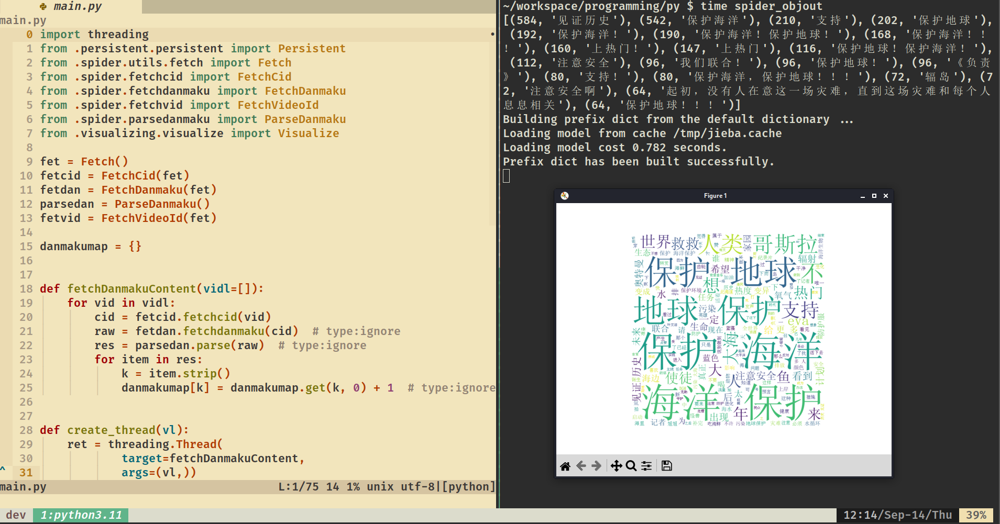
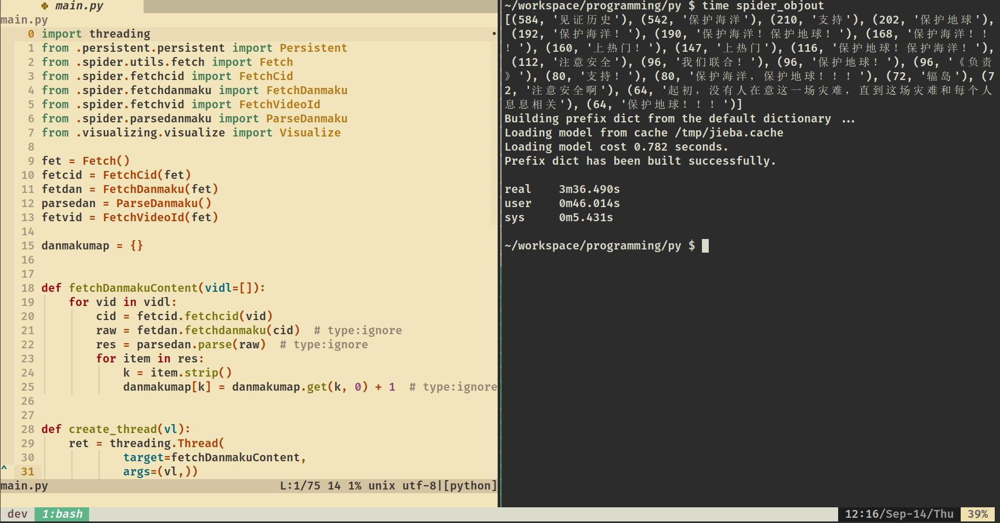

<!-- vim-markdown-toc GFM -->

* [Spider](#spider)
    * [Introduction](#introduction)
        * [Preview](#preview)
    * [Tech Stack](#tech-stack)
    * [Usage](#usage)
    * [Unit Test](#unit-test)
    * [Profiling](#profiling)

<!-- vim-markdown-toc -->

# Spider

## Introduction

A spider for Bilibili danmaku and visualizing.

### Preview






## Tech Stack

- Python 3
- Shell script

## Usage

Prerequisites:Make sure you have the following 
dependencies installed.
- `wget`
- `bash`
- `python3`
- `pip3`
- `python3-dev`
- `zlib-dev`
- `jpeg-dev`

```bash
# Run the following commands in your BASH.
mkdir -p $HOME/tmp/spider_venv
cd $HOME/tmp
python3 -m venv spider_venv
source spider_venv/bin/activate

git clone git@github.com:objout/spider_objout.git
cd spider_objout
pip3 install dist/spider_objout-0.0.1.tar.gz

spider_objout

deactivate
rm -rf $HOME/tmp/spider_venv
```

## Unit Test

```bash 
python3 -m unittest tests/test_getheaders.py
python3 -m unittest tests/*.py
```

## Profiling

```bash
cd src
python3 -m cProfile -o result.cprofile -m spider_objout.main
python3 profiling.py | grep "spider_objout" | sed 's/\/.*\///g' - | less
```
